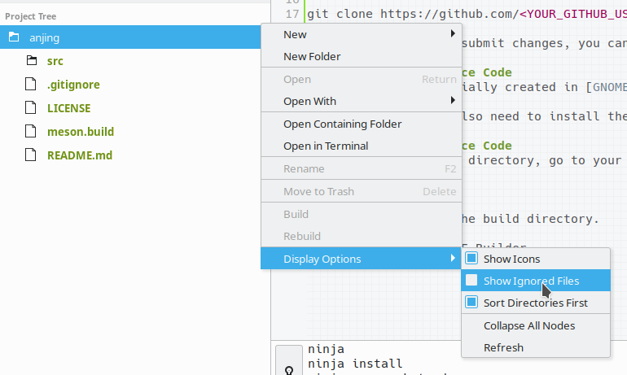

# Anjing - Project Management Made Simple
Anjing is a management tool built with Vala, which aims to allow management of projects from multiple categories and organizations.

## Working Instructions
Anjing uses [Git](https://git-scm.com), [Meson](https://mesonbuild.com), and [Ninja](https://ninja-build.org/) build systems to manage project revisions, builds, and releases. Before continuing, make sure that you have all of them installed.

Additionaly, you will also need to install the entire Vala package (which includes several GObject libraries and compilers), which can be found [here](https://wiki.gnome.org/Projects/Vala/ValaPlatforms). 

### Getting the Source Code
You can clone this repository on your system by running the Git command:
```
git clone https://github.com/reinhart1010/anjing.git
```

However, if you would like to contribute to this repository, please **Fork** this repository (on GitHub) first and clone the project from your newly-created repository; i.e. by running the Git command:
```
git clone https://github.com/<YOUR_GITHUB_USERNAME>/anjing.git
```
Once you're ready to submit changes, you can submit a **Pull Request** to us. For further information and guidelines, see CONTRIBUTING.md.

### Modifying on Source Code
This project was initially created in [GNOME Builder](https://wiki.gnome.org/Apps/Builder), hence it is highly recommended for Linux users to work with this source code. However, [Visual Studio Code](https://code.visualstudio.com) (**not** to be confused with [Visual Studio](https://visualstudio.com)) can also be used with [additional plugins](https://wiki.gnome.org/Projects/Vala/Tools/VisualStudioCode) to allow building and debugging of Vala projects in other platforms (Windows, macOS).

> **Note:** You may also need to install the full Adwaita icon pack (package `adwaita-icon-theme-full`) to ensure that all icons are loaded properly in GNOME Builder.

### Building the Source Code
To generate the build directory, go to your working directory in Terminal / Command Prompt and run
```
meson build
```
which will generate the build directory.

If you are using GNOME Builder, 

> If you cannot find the `build` directory on GNOME Builder (since it was ignored according to `.gitignore`), make sure that you have checked the **Show Ignored Files** option on the Project Tree dropdown.
> ;